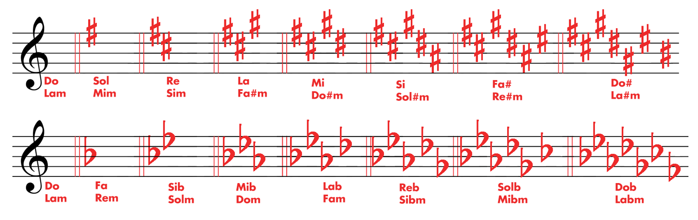
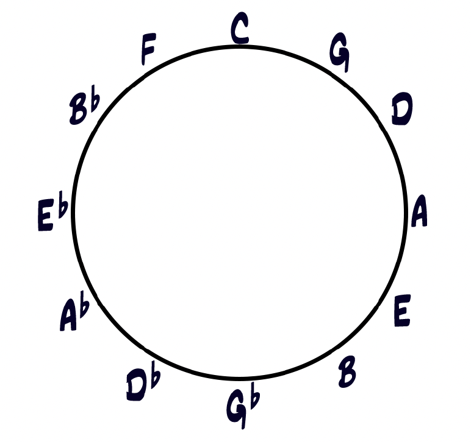
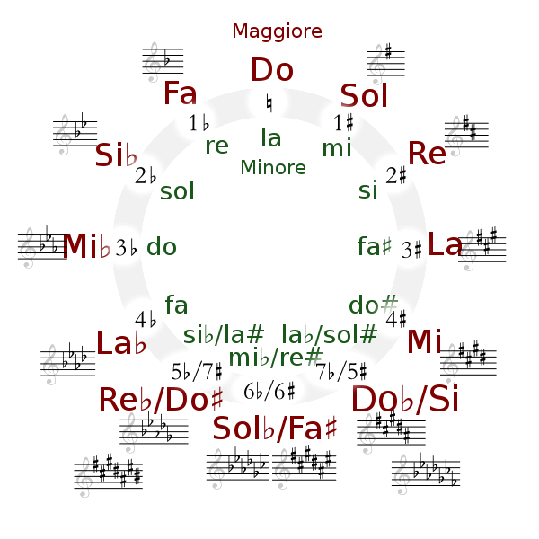

Scale
========

Scala cromatica
---------------

La scala cromatica è la cosa più semplice e più fraintesa dell’armonia moderna: **dodici note, tutti i semitoni**. Sulla carta sembra un oggetto “totale”, quasi banale. Nella pratica è uno degli strumenti più raffinati che esistano, perché ti costringe a chiarire una domanda fondamentale:

Se posso suonare tutto... cosa fa sì che qualcosa suoni giusto?

La risposta è: il contesto e, soprattutto, la direzione.

.. image:: 
   _static/music/scala-cromatica-ascendente.*
   :width: 100%

.. raw:: html

   <audio controls class="audio-controls">
      <source src="_static/music/scala-cromatica-ascendente.mp3" type="audio/mp3">
   </audio>

.. image:: 
   _static/music/scala-cromatica-discendente.*
   :width: 100%

.. raw:: html

   <audio controls class="audio-controls">
      <source src="_static/music/scala-cromatica-discendente.mp3" type="audio/mp3">
   </audio>

Non è una scala “da usare”... è una griglia
~~~~~~~~~~~~~~~~~~~~~~~~~~~~~~~~~~~~~~~~~~~

In un senso stretto, la scala cromatica non è una scala come maggiore o minore, perché non definisce un centro, non produce una gerarchia naturale, non ti dà una “casa” evidente. 

**È una griglia**: il materiale completo da cui poi ogni musica seleziona e organizza.

Per questo la cromatica è un ottimo test di onestà: se pensi che l’armonia sia un codice di permessi (“queste sì, queste no”), la cromatica ti manda in crisi. Se invece capisci che l’armonia è un sistema di attrazioni (bersagli, risoluzioni, tensioni), la cromatica diventa chiarissima.

Cromatismo... e tonalità: non sono nemici
~~~~~~~~~~~~~~~~~~~~~~~~~~~~~~~~~~~~~~~~~

Un equivoco comune è pensare che “cromatico” significhi “fuori tonalità”. In realtà, gran parte della musica tonale e jazzistica è cromatica proprio perché vuole restare tonale... ma con più espressività.

La tonalità non è “sette note”. È un centro di gravità.

Il cromatismo non cancella quel centro: lo rende più interessante, come le ombre rendono più evidente una luce. Nel jazz e nel blues, molte delle cose che suonano più “dentro” sono cromatiche, perché costruiscono una strada molto chiara verso una nota bersaglio.

Tre modi teorici di intendere il cromatismo
~~~~~~~~~~~~~~~~~~~~~~~~~~~~~~~~~~~~~~~~~~~

Senza entrare in tecniche “da metodo”, dal punto di vista teorico il cromatismo entra spesso in tre forme principali:

1. **Note di avvicinamento (approach notes)**
   
   Una nota cromatica esiste perché “punta” a un bersaglio diatonico o accordale. Il suo senso non è nel suo nome... è nella direzione.

2. **Note di passaggio**

   Tra due note strutturali (di scala o di accordo) inserisci il semitono intermedio. È un modo naturale di rendere continua una linea.

3. **Alterazioni funzionali**

   Alcune note cromatiche non sono “decorazioni”, ma creano proprio una tensione armonica riconoscibile (♭9, #9, #11, ♭13 sulle dominanti; leading tone temporanee; dominanti secondarie...). Qui il cromatismo non è ornamento: è funzione.

In tutti e tre i casi, il cromatismo non è un mondo separato. È un modo di aumentare la densità del discorso restando dentro una logica di attrazioni.

Perché la cromatica sembra “jazz”
~~~~~~~~~~~~~~~~~~~~~~~~~~~~~~~~~

Il jazz, specialmente in certe epoche (swing, bebop e oltre), ha reso il cromatismo un elemento di lingua. Non per fare confusione, ma per aumentare l’illusione del parlato: la linea melodica diventa più continua, più “vocale”, meno fatta di gradini.

Il cromatismo è una delle ragioni per cui il jazz può suonare sofisticato anche quando sta facendo una cosa semplicissima: andare da una nota importante a un’altra nota importante... con più sfumature.

La cromatica come idea filosofica
~~~~~~~~~~~~~~~~~~~~~~~~~~~~~~~~~

.. important::

   La scala cromatica ti mette davanti a una verità scomoda:

   **Non esistono note proibite... esistono note senza significato.**

Il significato lo creano:

- il **bersaglio** a cui ti stai avvicinando
- il **momento ritmico** in cui la suoni
- la **durata**
- la **risoluzione** (esplicita o implicita)
- il **contesto** armonico

Per questo si può dire una cosa paradossale ma vera: in musica tonale e jazz, la cromatica non è “fuori”. È un modo di stare dentro con più elasticità.

La cromatica è tutto il vocabolario... ma la musica nasce quando scegli quali parole contano, e come ci arrivi.

La scala maggiore
-----------------

Una scala è una successione ordinata di altezze all’interno di un’ottava, organizzata secondo intervalli precisi, che definisce un campo di possibilità sonore.

Non è un esercizio tecnico, né un elenco di note da memorizzare. **È una mappa di relazioni**.

La scala maggiore non è una sequenza di note da suonare in salita e in discesa. Quella è solo la sua ombra.

**La scala maggiore è un sistema di forze in equilibrio instabile**. Ogni nota ha un peso diverso, una funzione, una tendenza. Non stanno lì tutte allo stesso modo. Alcune spingono, altre trattengono, altre ancora sembrano neutrali solo in apparenza.

Quando ascolti una melodia tonale, non stai seguendo una scala. Stai seguendo un campo gravitazionale.

Se togli la gravità, restano solo punti nello spazio.

Se togli le funzioni, resta solo un esercizio meccanico.

La scala maggiore è una scala di sette suoni organizzata secondo una precisa sequenza di intervalli all’interno dell’ottava:

**tono – tono – semitono – tono – tono – tono – semitono**

Questa struttura genera un sistema stabile, gerarchico e direzionale, in cui ogni grado ha un ruolo riconoscibile rispetto alla **tonica**.

Una scala:

- stabilisce quali suoni appartengono a un **contesto**
- crea una **gerarchia** tra le note (alcune sono stabili, altre instabili)
- genera **tensioni e risoluzioni**
- suggerisce **direzioni**, *non frasi già scritte*

La scala *non dice cosa suonare*, ma **dove è possibile andare**.

.. attention::

   La scala non è musica.

La musica nasce quando:

- una nota viene scelta
- in un momento preciso
- con una durata
- **con un’intenzione**

Usare una scala come se fosse un contenitore di note “giuste” porta a suonare **correttamente ma senza senso**.

Gradi che vogliono andare da qualche parte
~~~~~~~~~~~~~~~~~~~~~~~~~~~~~~~~~~~~~~~~~~

Ogni grado della scala maggiore ha una direzione implicita. Non perché lo dice la teoria, ma perché l’orecchio lo percepisce così.

Alcune note sembrano voler restare dove sono. Altre sembrano chiedere di muoversi.

La sensazione di “arrivo” e quella di “attesa” non sono invenzioni didattiche. Le riconosci anche se non hai mai studiato. La teoria si limita a dare un nome a queste sensazioni.

Quando suoni una scala come una lista di possibilità, perdi tutto questo.

Quando inizi a sentire le note come gradi con una tendenza, la musica comincia a respirare.

Improvvisare non significa scegliere note corrette.

Significa decidere quando creare tensione e quando lasciarla andare.

All’interno della scala maggiore i gradi sono:

I. (tonica) stabilità
II. movimento
III. identità
IV. tensione verso la tonica
V. massima direzionalità
VI. area di ambiguità
VII. (sensibile) attrazione inevitabile verso la tonica

La scala maggiore **non è un esercizio e non è una diteggiatura**.

È una **struttura percettiva** che l’orecchio riconosce come “casa”.

Suonarla su e giù non significa usarla. Usarla significa **sentire il peso di ogni grado**.

Perché la tonica non è solo una nota
~~~~~~~~~~~~~~~~~~~~~~~~~~~~~~~~~~~~

La tonica non è semplicemente la prima nota della scala. È un centro.

È il punto rispetto al quale tutto acquista senso. Senza di lei, le altre note non sono né stabili né instabili. Sono solo altezze.

La tonica è una sensazione di ritorno, di casa, di conferma. Non ha bisogno di essere suonata per essere presente. Spesso è proprio quando manca che la senti di più.

Quando suoni pensando alla tonica come a un obiettivo implicito, anche le note lontane diventano comprensibili. Quando la perdi, tutto diventa piatto, anche se stai “nella scala”.

Per questo la scala maggiore non è un esercizio. È una mappa di attrazioni e repulsioni.

Se la studi come un disegno sulla tastiera, la memorizzi. Se la ascolti come un sistema di forze, la usi.

Scala maggiore di Do
~~~~~~~~~~~~~~~~~~~~

La scala maggiore di Do è la realizzazione più semplice e “trasparente” del modello di scala maggiore, perché non contiene alterazioni:

.. image:: 
   _static/music/scala-c-maggiore.*
   :width: 100%

.. raw:: html

   <audio controls class="audio-controls">
      <source src="_static/music/scala-c-maggiore.mp3" type="audio/mp3">
   </audio>

È importante perché:

- segue esattamente la formula
  
  tono – tono – semitono – tono – tono – tono – semitono

- rende immediatamente visibili i due semitoni naturali:

  Mi → Fa
  
  Si → Do

- è il riferimento didattico per comprendere tutte le altre scale maggiori

La scala di Do maggiore non è “più semplice” musicalmente delle altre.

È solo più leggibile graficamente.

La scala maggiore di Do è il modello base attraverso cui si comprende la struttura di tutte le scale maggiori, non un caso speciale.

Altre tonalità
~~~~~~~~~~~~~~

Se una scala maggiore inizia su una tonica diversa da Do, la formula della scala maggiore richiede che vengano apportate modifiche alle note dell’alfabeto musicale.

Per capire perché, proviamo a costruire una scala maggiore partendo dalla tonica Sol (G), seguendo passo dopo passo la formula (T-T-S-T-T-T-S).

La formula stabilisce che ci debba essere un tono tra il sesto e il settimo grado, e un semitono tra il settimo grado e l’ottava. Tuttavia, il semitono naturale tra Mi e Fa crea una discrepanza. 

La soluzione è alzare il settimo grado, Fa, di un semitono, aumentando così la distanza da Mi e diminuendo quella da Sol, cioè l’ottava. 

Questo si ottiene usando il diesis (#) davanti al Fa. Il diesis ha l’effetto di alzare la nota che segue di un semitono.

.. image:: 
   _static/music/scala-g-maggiore.*
   :width: 100%

.. raw:: html

   <audio controls class="audio-controls">
      <source src="_static/music/scala-g-maggiore.mp3" type="audio/mp3">
   </audio>

.. attention::

   Quando si pronuncia, il diesis si dice dopo il nome della nota, come in “Fa diesis”. Allo stesso modo, quando si scrive in un testo, il diesis segue il nome della nota: Fa♯. Quando invece si scrive sul pentagramma, il diesis si pone sempre prima della nota, sulla stessa linea o spazio della nota stessa.

Allo stesso modo possiamo costruire le scale maggiori in tutte le tonalità. 

Scale maggiori con bemolle:

.. image:: 
   _static/music/scale-maggiori-bemolle.*
   :width: 100%

Scale maggiori con diesis:

.. image:: 
   _static/music/scale-maggiori-diesis.*
   :width: 100%

Poiché ciascuna di queste scale richiede sempre l’uso di uno o più diesis (o bemolle) per essere costruita, per comodità questi vengono raccolti all’inizio di un brano musicale, accanto alla chiave. Questo insieme è chiamato armatura di chiave.

Collocare l’armatura all’inizio indica che i diesis devono essere applicati automaticamente per tutto il brano, in tutte le ottave (evitando così di doverli scrivere ogni volta davanti a ogni singola nota).

Il mondo “minore” e le sue ambiguità
------------------------------------

La differenza fondamentale tra una scala maggiore e una scala minore sta nel terzo grado.

- Scala maggiore → *terza* **maggiore**
- Scala minore → *terza* **minore**

Questa singola distanza cambia l’identità dell’intero sistema.

Lo schema essenziale è **tutto nelle prime cinque note**:

Do maggiore

.. image:: 
   _static/music/scala-c-maggiore-5note.*
   :width: 400px

.. raw:: html

   <audio controls class="audio-controls">
      <source src="_static/music/scala-c-maggiore-5note.mp3" type="audio/mp3">
   </audio>

Do minore

.. image:: 
   _static/music/scala-c-minore-5note.*
   :width: 400px

.. raw:: html

   <audio controls class="audio-controls">
      <source src="_static/music/scala-c-minore-5note.mp3" type="audio/mp3">
   </audio>

Da qui discende tutto il resto.

Esistono alcune differenze percettive.

Nel maggiore:

- la tonica è chiara
- le tensioni sono ordinate
- il sistema tende alla stabilità

Nel minore:

- il centro è meno definitivo
- le tensioni sono più ambigue
- il sistema è mobile: 
   - alcuni gradi cambiano identità
   - la scala non è mai una sola
   - le tensioni si adattano al contesto
   - l’orecchio accetta più versioni dello stesso suono

Tristezza, dramma, instabilità
~~~~~~~~~~~~~~~~~~~~~~~~~~~~~~

Dire che il minore... è triste... è una semplificazione comoda... ma insufficiente.

Il mondo minore non è semplicemente “più scuro” del maggiore. **È instabile, mobile, ambiguo**.

Dove il maggiore tende a dichiarare un centro, il minore lo *mette in discussione*.

Dove il maggiore organizza, il minore *oscilla*.

Dove il maggiore afferma, il minore *interroga*.

Per questo il minore è spesso associato a:

* dramma
* tensione irrisolta
* introspezione
* conflitto emotivo

Non perché sia debole, ma perché **non è mai definitivo**.

Le quattro scale minori
~~~~~~~~~~~~~~~~~~~~~~~

Ripartiamo dalla prime 5 note della scala di Do resa *minore* abbassando di un semitono il **terzo grado**:

.. image:: 
   _static/music/scala-c-minore-5note.*
   :width: 300px

Rimangono solo **2 gradi**: il sesto (VI) e il settimo (VII). Abbiamo 4 possibilità di combinazione di questi due gradi (minore o maggiore) da cui derivano **4 scale minori**.

.. tip::
   
   Dal punto di vista dell’orecchio, però, non esistono quattro mondi separati.
   
   Esistono diverse risposte a uno stesso problema percettivo:

   👉 come organizzare la tensione e il movimento intorno a una tonica minore.

Scala minore naturale
^^^^^^^^^^^^^^^^^^^^^

Se prendiamo sesto e settimo grado entrambi *minori*, cioè abbassati di un semitono, otteniamo la scala **minore naturale**:

.. image:: 
   _static/music/scala-c-minore-naturale.*
   :width: 100%

.. raw:: html

   <audio controls class="audio-controls">
      <source src="_static/music/scala-c-minore-naturale.mp3" type="audio/mp3">
   </audio>

Possiamo osservare come questa scala abbia la seguente struttura:

**tono – semitono – tono – tono – semitono – tono – tono**

I suoi gradi caratteristici:

- terza minore
- sesta minore
- settima minore

È il minore più “neutro”. Stabile, poco direzionale, con una tensione morbida e diffusa.

Non crea una forte attrazione verso la tonica. Descrive un ambiente, più che un movimento.

Scala minore armonica
^^^^^^^^^^^^^^^^^^^^^

Se prendiamo solo il sesto grado minore e lasciamo il settimo grado maggiore otteniamo la scala **minore armonica**:

.. image:: 
   _static/music/scala-c-minore-armonica.*
   :width: 100%

.. raw:: html

   <audio controls class="audio-controls">
      <source src="_static/music/scala-c-minore-armonica.mp3" type="audio/mp3">
   </audio>

La sua struttura è

**tono – semitono – tono – tono – semitono – tono e mezzo – semitono**

I suoi gradi caratteristici:

- terza minore
- sesta minore
- settima maggiore

Introduce una forte tensione verso la tonica grazie alla settima maggiore.

Vedremo più avanti che questa è la scala che rende possibile **la dominante nel modo minore** (concetto che chiariremo in seguito).

Il sistema diventa teso, verticale, quasi teatrale, drammatica, fortemente direzionale.

Scala minore melodica
^^^^^^^^^^^^^^^^^^^^^

Se prendiamo sesto e settimo grado entrambi *maggiori* otteniamo la scala **minore melodica**:

.. image:: 
   _static/music/scala-c-minore-melodica.*
   :width: 100%

.. raw:: html

   <audio controls class="audio-controls">
      <source src="_static/music/scala-c-minore-melodica.mp3" type="audio/mp3">
   </audio>

La sua struttura è:

**tono – semitono – tono – tono – tono – tono – semitono**

I suoi gradi caratteristici:

- terza minore
- sesta maggiore
- settima maggiore

Nasce per risolvere un problema melodico.

Rende il movimento più fluido, cantabile, meno rigido rispetto alla minore armonica.
Non è una scala “diversa”, ma una variazione funzionale in movimento.

È una soluzione melodica, non astratta.

Essa infatti consente una risoluzione migliore sulla tonica, grazie alla settima maggiore che "cade" in modo spontaneo sulla tonica. 
Inoltre è nata per dare una risoluzione alla tensione che crea la minore armonica con la sua seconda eccedente (o aumentata ), intervallo dissonante che si risolve esattamente alzando di un semitono il sesto grado o sopradominante, in modo da eliminare questo "salto proibito" di un tono più un semitono.

Per questo motivo, nascendo esplicitamente per questa necessità, che si presenta *solo in senso ascendente*, nella teoria "classica" questa scala torna ad essere una scala minore naturale in senso *discendente*:

.. image:: 
   _static/music/scala-c-minore-melodica-asc-desc.*
   :width: 100%

.. raw:: html

   <audio controls class="audio-controls">
      <source src="_static/music/scala-c-minore-melodica-asc-desc.mp3" type="audio/mp3">
   </audio>

In senso rigoroso è questa la forma della scala minore melodica. È comune trovare altri modi per indicare la scala minore melodica che include le alterazioni sul VI e VII grado sia in senso ascendente che discendente:

- scala bachiana
- scala jazz minor

La scala è denominata *bachiana* in onore di Bach il quale l'ha utilizzata spesso nelle proprie composizioni in quanto egli aveva bisogno di una scala minore che avesse un suono invariato sia a salire che a scendere e che non risultasse "orientale" alle orecchie di chi la ascoltava.

In tutto il materiale noi ci riferiremo con il nome di la scala minore melodica intendendo la scala identica sia in senso ascendente sia discendente.

Scala dorica
^^^^^^^^^^^^

Infine abbiamo l'ultima combinazione: il sesto grado resta maggiore e prendiamo il settimo grado minore.

.. image:: 
   _static/music/scala-c-minore-dorica.*
   :width: 100%

.. raw:: html

   <audio controls class="audio-controls">
      <source src="_static/music/scala-c-minore-dorica.mp3" type="audio/mp3">
   </audio>

La sua struttura è:

**tono – semitono – tono – tono – tono – semitono – tono**

L’effetto è un minore più luminoso, aperto, meno tragico.

L’orecchio la percepisce come minore, ma **non drammatico**.

Perché la musica non sceglie mai una sola versione
~~~~~~~~~~~~~~~~~~~~~~~~~~~~~~~~~~~~~~~~~~~~~~~~~~

Queste quattro scale non sono alternative teoriche, ma **quattro modi diversi di organizzare il mondo minore** in base a ciò che la musica deve dire.

Nella musica reale, soprattutto quella viva, improvvisata o cantabile, il **minore non si presenta mai in forma pura**.

Le tre versioni convivono, si sovrappongono, si contaminano. Non per confusione, ma per **necessità espressiva**.

La musica:

- prende la settima maggiore quando vuole direzione
- torna alla settima minore quando vuole sospensione
- modifica il sesto grado per ammorbidire o accentuare il movimento

Tutto questo avviene **prima della teoria**. La teoria arriva dopo, per descrivere ciò che l’orecchio ha già accettato.

.. important::

   Il mondo minore insegna una lezione fondamentale:

   La musica non è un sistema di scelte binarie, ma un equilibrio continuo tra possibilità.

Capire il minore significa accettare che l’**ambiguità non è un difetto**, ma una delle sue risorse più potenti.

Ed è proprio qui che la musica smette di essere una formula e diventa linguaggio.

Scale minori "esotiche"
~~~~~~~~~~~~~~~~~~~~~~~

Se c’è un intervallo che cambia immediatamente il sapore di una scala, è la **seconda minore**.

È quella distanza ravvicinata, quasi “a contatto”, che crea attrito… e proprio per questo **direzione**.

Se inseriamo questo intervallo nelle scale minori viste in precedenza (al posto della seconda maggiore) otteniamo tensione che non è un incidente: è una caratteristica strutturale. Non è qualcosa da evitare… è qualcosa da abitare e che crea un effetto, potremmo dire, "esotico".

Il termine "esotiche" è un po’ fuorviante, ma utile.

Chiamiamo così quelle scale che escono dal sistema maggiore/minore “classico” occidentale e introducono combinazioni intervallari meno familiari, spesso legate a tradizioni mediorientali, indiane o dell’Europa dell’est.

Ma al di là dell’etichetta geografica, quello che conta davvero è questo:  la presenza della seconda minore crea un **campo di tensione stabile**, non momentaneo.

Non è una nota di passaggio. È una relazione strutturale.

Scala frigia
^^^^^^^^^^^^

Iniziamo sostituendo la seconda minore alla scala minore naturale, la scala che otteniamo prende il nome di **frigia**:

.. image:: 
   _static/music/scala-c-frigia.*
   :width: 100%

.. raw:: html

   <audio controls class="audio-controls">
      <source src="_static/music/scala-c-frigia.mp3" type="audio/mp3">
   </audio>

È probabilmente il suono più immediatamente riconoscibile tra le scale “esotiche”.

Quella ♭2 sopra la tonica crea tensione immediata e senso di gravità molto marcato.

Scala minore napoletana
^^^^^^^^^^^^^^^^^^^^^^^

Tra le scale “esotiche”, la minore napoletana è una di quelle che hanno un carattere fortissimo ma allo stesso tempo molto “ordinato”.

Non è caotica… è inevitabile.

Se la guardi bene, è quasi una minore armonica… con una differenza decisiva: la seconda minore tra 1 e ♭2.

.. image:: 
   _static/music/scala-c-minore-napoletana.*
   :width: 100%

.. raw:: html

   <audio controls class="audio-controls">
      <source src="_static/music/scala-c-minore-napoletana.mp3" type="audio/mp3">
   </audio>

Quindi hai contemporaneamente:

- la tensione “orientale” della ♭2
- la spinta tonale fortissima della 7 maggiore

È questa combinazione che la rende così particolare.

Rispetto alla frigia è meno “statica” e più direzionale.

Rispetto alla minore armonica pè iù scura all’inizio (per via della ♭2) ma con la stessa spinta a risolvere.

Attenzione a come usarla (senza “usarla”)!

Il punto non è dire:

  “su questo accordo suono la minore napoletana”

Piuttosto:

- Prendi 1 e ♭2
  
  resta lì… ascolta cosa succede

- Aggiungi la 7 maggiore
  
  senti come cambia la gravità

- Costruisci piccole frasi:
  
  ♭2 → 1
  
  7 → 1
  
  ♭6 → 7 → 1

Non serve tutta la scala. Bastano tre o quattro note ben sentite.

Se alziamo il sesto grado otteniamo una versione che deriva dalla scala minore melodica (con il secondo grado minore). Questa scala prende il nome di **scala maggiore napoletana**. Nome che crea non poca confusione perché *non si tratta di una scala maggiore*, ma qui l'aggettivo *maggiore* si riferisce al sesto grado e non al terzo:

.. image:: 
   _static/music/scala-c-maggiore-napoletana.*
   :width: 100%

.. raw:: html

   <audio controls class="audio-controls">
      <source src="_static/music/scala-c-maggiore-napoletana.mp3" type="audio/mp3">
   </audio>

Scala dorica ♭2
^^^^^^^^^^^^^^^

Infine prendiamo la scala dorica e abbassiamo il secondo grado. Questa scala può essere vista sia come una **dorica ♭2** sia come una **frigia ♮6**.

.. image:: 
   _static/music/scala-c-minore-dorica-b2.*
   :width: 100%

.. raw:: html

   <audio controls class="audio-controls">
      <source src="_static/music/scala-c-minore-dorica-b2.mp3" type="audio/mp3">
   </audio>

È una scala molto elegante perché mescola:

- ♭2 → colore frigio, tensione immediata
- 6 maggiore → apertura dorica
- ♭7 → niente leading tone, quindi meno “tonale”

Risultato:

- meno “chiusa” della frigia
- meno “direzionale” della minore melodica
- ma con un’identità fortissima

Il circolo delle quinte
-----------------------

Il **circolo delle quinte** è una rappresentazione ordinata delle tonalità in cui ogni centro tonale è posto a **distanza di una quinta giusta dal precedente**. 

Se lo percorri in senso opposto, ottieni il **circolo delle quarte**. 

Non sono due oggetti diversi: è lo stesso fenomeno visto in due direzioni.

Possimao notare come, in termini di "tonalità" ovvero della scala maggiore avente come tonica una determinata nota del cerchio, il circolo mostra che:

- salendo di quinte aggiungi un diesis alla scala
- scendendo di quarte aggiungi un bemolle

Ma questa è solo la superficie.

Il circolo delle quinte esiste perché **la quinta giusta è l’intervallo strutturalmente più stabile dopo l’ottava**. 

È il primo legame forte che l’orecchio riconosce tra due altezze diverse.

Quando una tonalità si muove verso la sua dominante (una quinta sopra), l’orecchio percepisce continuità.

Quando si muove verso la sottodominante (una quarta sopra), percepisce allontanamento controllato.

Il circolo non nasce come schema teorico, ma come **mappa delle relazioni più naturali tra i centri tonali**.

Le tonalità vicine nel circolo:

- condividono quasi tutte le note
- differiscono solo per un grado
- permettono modulazioni fluide

Per questo il circolo è una **mappa di prossimità**, *non un elenco*.

Due tonalità lontane nel circolo:

- condividono poche note
- richiedono più alterazioni
- producono un cambio di gravità più evidente

Il circolo ordina queste distanze in modo progressivo.

Parlare di circolo delle quinte o delle quarte dipende solo da da dove guardi il movimento:

- quinta sopra → movimento dominante
- quarta sopra → movimento sottodominante

La struttura è identica. Cambia la direzione del racconto.

.. attention::

   Il circolo non è una tabella da studiare

Il circolo delle quinte non serve a:

- memorizzare tonalità
- fare calcoli
- “sapere dove sei”

Serve a capire:

- perché certe progressioni funzionano sempre
- perché alcune modulazioni sono naturali
- perché l’armonia tende a muoversi in certi modi

È una mappa delle attrazioni, non un esercizio mnemonico.

Il circolo delle quinte è la rappresentazione delle relazioni di massima stabilità tra i centri tonali, ordinata secondo l’intervallo che l’orecchio riconosce come più naturale dopo l’ottava.

Quando lo capisci così, smette di essere un disegno e diventa un modo di ascoltare il movimento armonico.

Scala pentatonica
-----------------

La pentatonica è una di quelle cose che, se la prendi nel modo giusto, ti cambia la vita... se la prendi come “forma da ripetere”, **ti intrappola**.

È una scala di **5 note**. Sembra poco. In realtà è un set di note **stabili, cantabili, resistenti**: funziona su tanti accordi, regge il tempo, e soprattutto si presta a quel tipo di fraseggio “parlato” che fa subito musica.

Che cos’è davvero
~~~~~~~~~~~~~~~~~

“Pentatonica” significa semplicemente “a cinque suoni”. Le due famiglie più usate sono:

**Pentatonica maggiore: 1 - 2 - 3 - 5 - 6**

.. image:: 
   _static/music/scala-c-pentatonica-maggiore.*
   :width: 500px

.. raw:: html

   <audio controls class="audio-controls">
      <source src="_static/music/scala-c-pentatonica-maggiore.mp3" type="audio/mp3">
   </audio>

**Pentatonica minore: 1 - b3 - 4 - 5 - b7**

.. image:: 
   _static/music/scala-c-pentatonica-minore.*
   :width: 500px

.. raw:: html

   <audio controls class="audio-controls">
      <source src="_static/music/scala-c-pentatonica-minore.mp3" type="audio/mp3">
   </audio>

La cosa importante non è la formula... è l’effetto: togliendo due gradi della scala diatonica, elimini molte frizioni “automatiche” e ottieni una tavolozza che suona bene anche quando l’armonia sotto si muove.

Perché suona bene quasi sempre
~~~~~~~~~~~~~~~~~~~~~~~~~~~~~~

La pentatonica contiene soprattutto:

- note dell’accordo (o note vicinissime)
- intervalli molto cantabili
- poche “spine” che ti costringono a risolvere subito

Ecco perché la senti ovunque: folk, rock, blues, pop, jazz... è una lingua trasversale.

Un modo molto “pulito” di capire perché la pentatonica suona così bene è questo: non pensare a una scala... pensa a una pila di quinte.

La pentatonica maggiore (e di riflesso la relativa minore) può essere ottenuta prendendo cinque note consecutive nel circolo delle quinte. Quello che ottieni è un insieme di suoni che si incastrano naturalmente, perché la quinta è l’intervallo più stabile dopo l’ottava.

.. image:: 
   _static/music/pentatonica-pila.*
   :width: 500px

Ora “metti in ordine” queste note dentro un’ottava:

.. image:: 
   _static/music/pentatonica-ordinata.*
   :width: 500px

Risultato: Do pentatonica maggiore.

Quindi la pentatonica non è solo “una scala di 5 note”... è un frammento del giro delle quinte, cioè una porzione di armonia naturale.

Maggiore e minore... e il trucco più utile
~~~~~~~~~~~~~~~~~~~~~~~~~~~~~~~~~~~~~~~~~~

Pentatonica maggiore e minore sono parenti strettissimi.

La pentatonica maggiore di C (C D E G A) è la stessa collezione di note della pentatonica minore di A (A C D E G). Cambia solo il centro, cioè la nota che senti come “casa”.

Questa cosa è pratica perché ti insegna una lezione enorme: non sono le note a decidere tutto... è il centro che ci metti tu.

Pentatonica minore e blues
~~~~~~~~~~~~~~~~~~~~~~~~~~

La pentatonica minore è la spina dorsale del blues. E il motivo è proprio quella b3 sopra accordi spesso maggiori: crea l’ambiguità espressiva del blues, quel “pianto e sorriso insieme”.

Se aggiungi anche la **quinta diminuita** (♭5) ottieni la famosa "**scala blues**":

.. image:: 
   _static/music/scala-c-blues.*
   :width: 600px

.. raw:: html

   <audio controls class="audio-controls">
      <source src="_static/music/scala-c-blues.mp3" type="audio/mp3">
   </audio>

Non serve pensare “aggiungo la blue note” come teoria... pensa “aggiungo una nota di passaggio, un graffio”. È un gesto, non un calcolo.

L’errore classico: la pentatonica come ginnastica
~~~~~~~~~~~~~~~~~~~~~~~~~~~~~~~~~~~~~~~~~~~~~~~~~

Molti imparano la pentatonica come cinque box e poi la suonano su e giù. Funziona per due giorni... poi suona sempre uguale.

La via d’uscita è semplice: pensala come intervalli e bersagli, non come disegno.

Prova a chiederti sempre:

- Qual è la nota di arrivo che voglio sentire?
- Sto atterrando su 1... 3/b3... 5... b7?
- Sto ripetendo un’idea o sto solo correndo?

Pentatonica nel jazz
~~~~~~~~~~~~~~~~~~~~

Nel jazz la pentatonica non è “la scala del rock”... è un modo elegante di dire molto con poco, spesso con sovrapposizioni intelligenti.

Due esempi di concetto (senza matematica pesante):

- su un accordo minore... la pentatonica minore spesso coincide con il suo colore base
- su dominanti e cadenze... una pentatonica scelta bene può dare 9, 11, 13 o alterazioni senza dover “pensare la scala intera”

Qui l’orecchio comanda: scegli la pentatonica che ti dà le tensioni che vuoi sentire... e poi fraseggia.

Pentatonica... universale, non “blues”
~~~~~~~~~~~~~~~~~~~~~~~~~~~~~~~~~~~~~~

Ogni tanto la pentatonica viene chiamata “**scala cinese**”. Non è del tutto sbagliato... ma è molto incompleto, e rischia di creare un altro equivoco: che la pentatonica, da sola, abbia già un “genere” dentro.

La pentatonica non è un genere. È un insieme di cinque gradi molto stabile, presente in tantissime culture musicali. Il blues, invece, è una lingua storica e sonora specifica. Può usare la pentatonica come materiale... ma non coincide con essa.

La pentatonica maggiore è una scala *anemitonica*, cioè **senza semitoni**. Questa assenza di attriti “obbligati” la rende:

- facilmente cantabile
- facilmente memorizzabile
- compatibile con molte melodie popolari
- molto adatta a sistemi musicali e strumenti diversi

Per questo la trovi in repertori tradizionali dell’Asia orientale ma anche in musiche celtiche, africane, americane, mediterranee. Chiamarla “cinese” è più una semplificazione storica occidentale che una definizione teorica precisa.

La pentatonica “pura” è neutra nel senso migliore del termine: non impone una grammatica armonica rigida.

Prendiamo la pentatonica maggiore: 1 2 3 5 6. Se la confronti con la scala maggiore completa (1 2 3 4 5 6 7), noti che mancano 4 e 7... proprio i due gradi che, nella tonalità europea, creano le tensioni più direzionali (la 4 verso la 3, la 7 verso la 1). Togliendo quelle due calamite, ottieni un suono aperto, “senza spigoli”, che non ti costringe a risolvere in modo specifico.

Il blues invece nasce e vive di attriti. Attriti di intonazione, di espressività, di ambiguità.

Quindi: una pentatonica suonata in modo perfettamente temperato e “pulito” tende a evocare un colore folk, arcaico, universale... non necessariamente blues.

Cosa rende blues quel materiale è un comportamento melodico e armonico.

1. **Ambiguità maggiore/minore**

   Il blues fa convivere gradi “minori” nella melodia (b3, b7) con un contesto armonico spesso “maggiore” (il tipico I7). Questa convivenza non è un errore teorico... è identità stilistica.

2. **Blue notes come zona, non come tasto**

   Le cosiddette blue notes (soprattutto intorno alla terza e alla quinta) non sono sempre altezze fisse. Sono spesso percepite come una zona espressiva, una flessione tra due poli (per esempio tra b3 e 3). Questo è un punto cruciale: molte descrizioni teoriche scrivono b3 o b5 come se fossero note “uguali alle altre”, ma nel blues la loro forza nasce proprio dal fatto che non sono semplicemente gradi... sono inflessioni.

3. **Armonia “non accademica” ma coerente**

   Il blues usa spesso accordi di dominante anche dove l’armonia classica si aspetterebbe altro. Il risultato non è caos: è una coerenza diversa, basata su colore e funzione emotiva più che su regole di risoluzione.

In sintesi: la pentatonica è un set di suoni estremamente antico e diffuso, che può suonare “neutro” o “tradizionale” in tanti modi. Il blues prende parte di quel materiale e lo trasforma in lingua... grazie a un contesto storico, a una pronuncia (intonazione e gesto) e a una logica armonica propria.

.. important::

   La pentatonica è materiale... il blues è grammatica, accento e significato.
